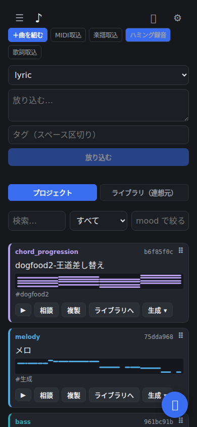
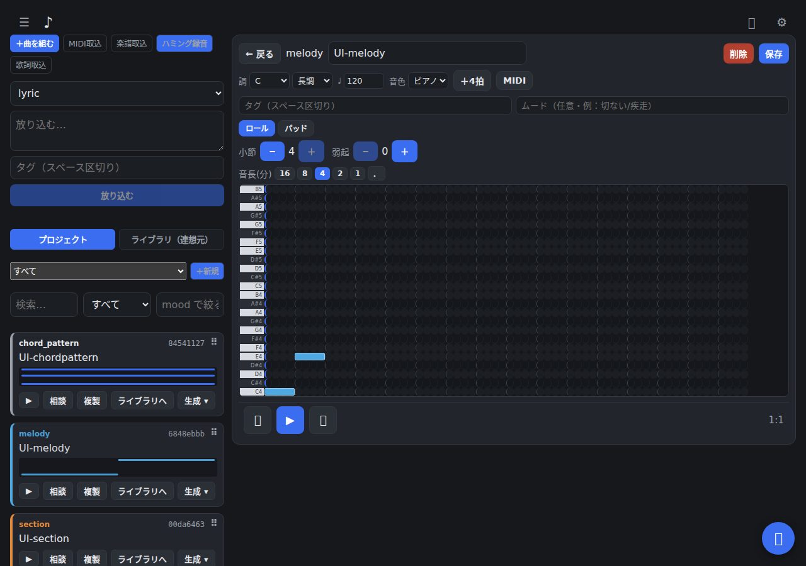
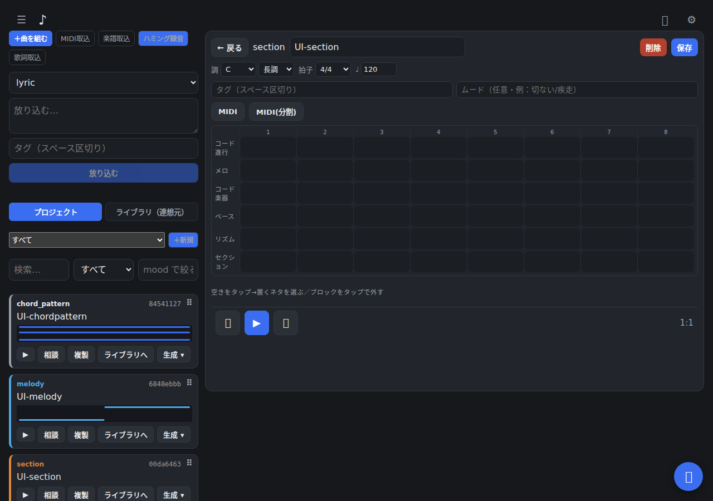

# Otomemo（音メモ）

手早く音を出してメモする、スマホ優先の作曲スケッチ PWA。思いついた瞬間に、
メロディ・コード進行・ベース・リズム・歌詞などの**素材を貯め・探し・組み合わせ・書き出す**、
自己ホスト型の作曲支援ツール。

（旧称 `creative_manager`。設計思想と経緯は `docs/`：`requirements.md` / `architecture.md` / `design.md`。）

<p align="center">
  
</p>
<p align="center"><sub><em>スマホ優先。色分けカード＋ミニピアノロールで、細切れ時間でも素材を貯め・探し・組み合わせ・書き出す。</em></sub></p>

<p align="center">
  
  
</p>
<p align="center"><sub><em>ピアノロールでメロディを描き（左）、セクションでパートを重ねて一曲にする（右）。調・拍子・テンポは曲側が持ち、素材は固定キー基準で保存して表示時に移調する。</em></sub></p>

## できること
- **メモする**：メロディ・コード進行・ベース・リズム・コード楽器・歌詞・テーマ・セクション・曲 を最小手数で記録（オフラインでも失わない）。MIDI／楽譜の取り込み・ハミング入力。
- **探す**：色分けカード＋種類/ムードでの絞り込み＋**セマンティック検索**（日本語埋め込みモデル Ruri v3）。**プロジェクト（1曲分の箱）**で素材を束ねる。検索サーバが落ちてもキーワード検索へ自動フォールバックし、その旨を表示。
- **編集**：種類ごとのエディタ（ピアノロール／度数グリッド／コード／ステップ）。調・拍子・テンポ・音色・弱起（アウフタクト）、Undo/Redo、自動保存。
- **組み立て**：`section`（複数パートを縦に重ねる）／`song`（section を時間順に並べる）のタイムライン。空きマスから素材ピッカー（検索／プロジェクト／拍子＋**データセットからのおすすめ**／新規作成）。ループの尺伸ばし。
- **自動生成（オフライン・待ち時間ゼロ・API課金なし）**：あるコード進行に合わせてメロディ／ベース／ドラムを生成、ハモリ付け、バリエーション生成、移調、コードへのフィット、パート同士の噛み合い診断。
- **AI に相談（Chat 💬）**：Claude を使った相談／リサーチをストリーミング表示。生成候補は試聴してから保存、書き込みは取り消し可能、結果はメモとして保存できる。**バックグラウンド・リサーチ**＝裏で調べて参考曲を集め、受信トレイに届ける。
- **書き出し**：MIDI（全パート合成／パート別分割・ドラムは ch10・トラック名は ASCII）。SoundFont の差し替え・GM 音色の試聴。カラーテーマ。

## 構成
| | | |
|---|---|---|
| `apps/api` | TypeScript / Fastify / better-sqlite3 | 操作の中核（素材の CRUD・検索・ジョブ）＋**オフラインで完結する音楽生成エンジン**（生成／フィット／解析）を **HTTP** と **MCP(stdio)** で公開。Chat の Claude 中継・バックグラウンドリサーチの実行もここ |
| `apps/web` | React / Vite | スマホ優先 PWA |
| `apps/worker` | Python / uv | **セマンティック検索（cm-search）専用**。※生成・リサーチ・MIDI取り込みは全て api(TypeScript/MCP)側に集約 |

データは単一の SQLite（`data/cm.sqlite`、WAL）。TypeScript↔Python の境界は **DB のみ**（検索サーバが素材を読んで意味インデックスを張る）。ジョブは api(TypeScript) 内で完結する。

## 起動
本番は api が web のビルド成果物も配信＝**外部公開は :8787 の1ポートだけ**（開発時は Vite）。
```sh
pnpm install
uv sync --directory apps/worker      # 初回：埋め込みモデル等をダウンロード

DB=$PWD/data/cm.sqlite
CM_DB=$DB pnpm --filter @cm/api start                 # API（web配信込み）:8787
pnpm --filter @cm/web dev                             # Web dev :5173 (/api→8787)
CM_DB=$DB uv run --directory apps/worker cm-search    # セマンティック検索 :8788
```
（生成・リサーチ・MIDI取り込みは api 内で完結＝別プロセス不要。）
スマホ等からは Tailscale 経由、または `http://<ホストのIP>:8787`。WSL2 mirrored の場合は Windows の
Hyper‑V ファイアウォールで 5173/8787 の inbound 許可が必要（`allow-creative-manager.cmd` 同梱）。

MCP：`.mcp.json` 同梱。Claude Code でこのリポジトリを開けば `creative-manager` ツールが使える。

## テスト
```sh
pnpm -r test                            # TypeScript（api + web）
uv run --directory apps/worker pytest   # Python worker
```

## バックアップ（データを失わない）
```sh
CM_DB=$PWD/data/cm.sqlite ./scripts/backup.sh   # data/backups/ に世代コピー（既定14世代）
# cron 例（毎時）:  0 * * * * CM_DB=/abs/path/data/cm.sqlite /abs/path/scripts/backup.sh
```

## 設計の芯
- すべての素材は**再帰的に入れ子にできる**（DAG 構造）。テンポ・拍子・調は section/song 側が持ち、音楽要素は**固定キー基準で保存し、表示・再生時に移調する**。
- **会話とリサーチだけ AI（Claude）**を使い、**音楽生成はオフラインで完結する自作エンジンが主**（待ち時間ゼロ・API課金なし）。設計思想は**「機械は候補（選択肢）まで提示し、仕上げは人間がやる」**。
- セマンティック検索は総当たりのコサイン類似度（この規模では十分）。詳細・未決事項は `docs/`。

## ライセンス
本体コードは **MIT**（[LICENSE](LICENSE)）。個人の作曲支援ツールを公開しているもので、そのまま使う・改変する・参照するのは自由。

### 帰属・第三者コンポーネントの注意
自作の TypeScript 生成エンジンと web は MIT で完結。ただし**任意で使う重い外部コンポーネントは各自のライセンスに従う**：
- **PESTO（`pesto-pitch`・音源のピッチ推定）＝非商用寄りライセンス**。音源解析用の Python サイドカー（`apps/audio`・任意機能）でのみ使用。**商用利用を考えるなら置き換え／除去が要る**。
- **VOICEVOX（ガイドボーカルの歌声合成）**：本リポジトリには**同梱していない**。利用者が自分でインストールし localhost 接続する設計。生成した歌声を配布する場合は各話者の利用規約（クレジット表記等）に従うこと。
- **データセット由来の統計**（`data/corpus-stats/`）は**集計統計のみ**で、実際の旋律・モチーフは保存していない（POP909 等・著作権への配慮）。生データは含まない。
- **Claude（Chat の AI アシスタント）**：利用者自身のアカウント／CLI を使う想定（BYO）。本ソフトには含まれず、再配布もしない。
- 主な OSS：Fastify / React / Vite / Tone.js / smplr / better-sqlite3 / demucs / librosa / pyopenjtalk / sentence-transformers（Ruri v3 埋め込み）。各々のライセンスに従う。
